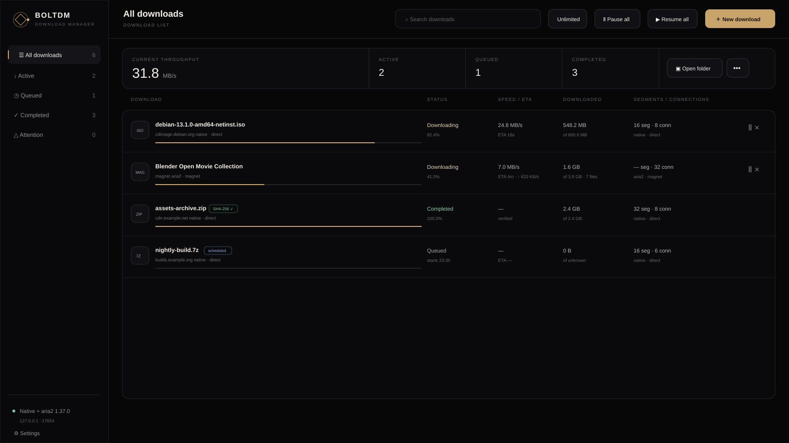
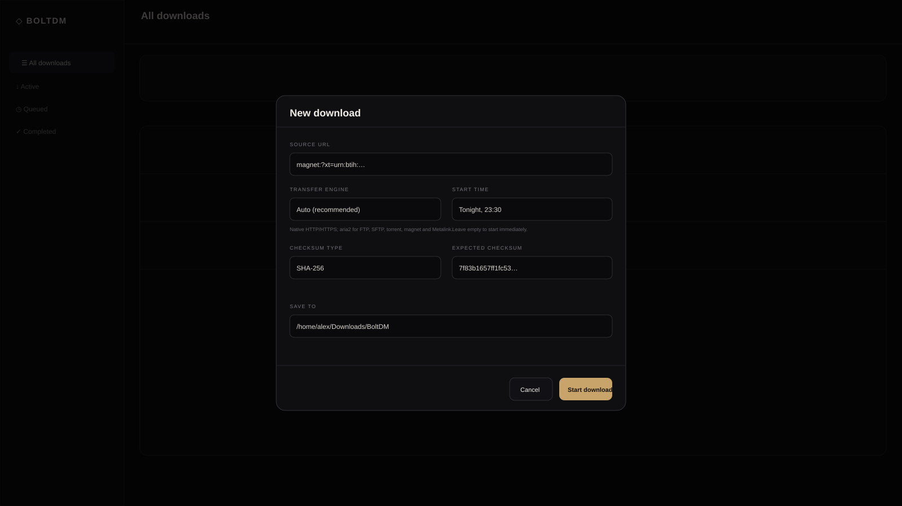

# BoltDM

BoltDM is a download manager written in Go for **Windows and Linux**. It includes a native HTTP/HTTPS engine, optional aria2 integration for additional protocols, and a Chrome/Firefox-compatible extension that can find many similar download buttons on one page and send all of their links to BoltDM.

Ordinary HTTP/HTTPS files use BoltDM's native segmented downloader. When `aria2c` is available, BoltDM can also handle FTP, SFTP, magnet links, remote torrent files, and Metalink sources.

## Screenshots

### Dashboard



### New download



## Main features

- Windows and Linux support.
- Download several files at the same time.
- Split one HTTP/HTTPS file into segments.
- Set the number of connections used for each file.
- Pause and resume one download or the whole queue.
- Retry failed downloads.
- Set a global speed limit for the native engine.
- Use speed limit presets or enter a custom value.
- Change the default download folder.
- Move an in-progress native-engine download to another folder.
- Keep partial native-engine data when a download is paused or moved.
- Change segment and connection settings without deleting valid partial data.
- Use aria2 for FTP, SFTP, magnets, remote `.torrent` files, and Metalink.
- Restore managed aria2 session state across BoltDM restarts.
- Schedule a download to start at a future time.
- Verify completed downloads with MD5, SHA-1, SHA-256, or SHA-512.
- Show transfer engine/source information in the dashboard.
- Open a completed file or multi-file output directory.
- Reveal downloads in the platform file manager.
- Remove a download from the list or safely delete its files.
- Keep BoltDM running in the Windows system tray.
- Change the font, font size, font weight, font style, spacing, colors, corner size, and custom CSS.

## Transfer engines

BoltDM owns the queue, task state, history, local API, scheduling, integrity verification, and UI. Transfer engines only execute transfers.

Default routing:

| Source | Engine |
| --- | --- |
| HTTP / HTTPS file | BoltDM native |
| FTP | aria2 |
| SFTP | aria2 |
| Magnet | aria2 |
| Remote `.torrent` URL | aria2 |
| `.meta4` / `.metalink` | aria2 |

aria2 is optional. In the default `auto` mode BoltDM looks for `aria2c` next to the BoltDM executable and then on `PATH`. An external aria2 JSON-RPC service can also be configured. BoltDM does not bundle an aria2 binary yet.

Detailed architecture, configuration, safety behavior, licensing notes, and current limitations are documented in [docs/TRANSFER_ENGINES.md](docs/TRANSFER_ENGINES.md).

## Browser extension

The extension is made for pages that contain many similar download buttons.

1. Start BoltDM.
2. Open the page with the download buttons.
3. Open the BoltDM extension.
4. Click **Select download button**.
5. Click one download button on the page.
6. The extension finds similar buttons and collects their links.
7. Review the links.
8. Send them to BoltDM.

The extension sends links directly to BoltDM on your computer. It does not use the browser's normal download list and does not require Free Download Manager.

## Download settings

BoltDM keeps **segments** and **connections** separate.

- **Segments** control how a direct file is split for resume data.
- **Connections** control how many parts of that file are downloaded at the same time.

Example:

```text
Segments: 32
Connections: 6
```

This keeps 32 resume segments but uses at most 6 active connections for that file.

You can also set concurrent files, per-host concurrency, minimum segment size, retries, defaults, native-engine speed limit, scheduled start time, and optional checksum verification.

## Speed limit

BoltDM has speed limit presets and a custom input. You can enter a value in KB/s or MB/s; `0` means unlimited.

The current global limiter is shared by all active **native-engine** downloads and connections. Cross-engine aggregate limiting with aria2 is not implemented yet.

## Download folders

You can change the default download folder at any time.

For native-engine downloads, you can also move an in-progress download to another folder. BoltDM pauses that download, closes its file, moves the partial file and resume data, updates the folder, and resumes the download if it was active before the move. This also works across drives/filesystems.

Moving aria2-managed tasks is intentionally blocked for now rather than moving files behind aria2's resume/session state.

## Linux

BoltDM runs as a local process and opens its dashboard in your default browser at `http://127.0.0.1:17654`.

Recommended packages:

```bash
# Debian / Ubuntu
sudo apt install xdg-utils zenity aria2

# Fedora
sudo dnf install xdg-utils zenity aria2

# Arch
sudo pacman -S xdg-utils zenity aria2
```

`aria2` is optional and is only required for aria2-backed protocols. `zenity` is optional; without it you can still type folder paths manually.

### Build a Linux package

Requires Go 1.23+:

```bash
./build.sh
```

On Linux this produces:

```text
dist/BoltDM-linux-<arch>.tar.gz
dist/BoltDM-linux-<arch>.tar.gz.sha256
```

The archive contains the BoltDM binary, updater, Linux installer, desktop icon, and license.

### Install for the current user

From the source tree or extracted Linux archive:

```bash
chmod +x install-linux.sh
./install-linux.sh
```

The installer uses no root privileges by default and installs to:

```text
~/.local/bin/boltdm
~/.local/share/applications/boltdm.desktop
~/.local/share/icons/hicolor/scalable/apps/boltdm.svg
```

Linux state defaults to:

```text
$XDG_STATE_HOME/boltdm
```

or, if `XDG_STATE_HOME` is unset:

```text
~/.local/state/boltdm
```

Existing Linux installations that already use `~/.boltdm` continue using it automatically. Set `BOLTDM_STATE_DIR` to override the state location explicitly.

Linux currently uses the browser dashboard rather than a native system tray. A saved `tray` launch preference will therefore still open the dashboard instead of leaving BoltDM invisible.

## Windows system tray

On Windows, BoltDM can stay in the system tray while downloads are running.

Tray menu:

- **Open BoltDM**
- **Pause all**
- **Resume all**
- **Exit BoltDM**

Closing the browser page does not close BoltDM. Use **Exit BoltDM** or the dashboard Quit action for a full shutdown.

## Appearance settings

You can change the font family, size, weight and style; layout density; accent/background/panel/text colors; corner radius; reduced motion; and custom CSS.

Custom CSS is loaded after the built-in stylesheet and can override interface details that do not have a dedicated setting yet.

## aria2 configuration

The default mode is `auto`.

Environment overrides:

```text
BOLTDM_ARIA2_MODE=auto|external|off
BOLTDM_ARIA2_EXECUTABLE=path/to/aria2c
BOLTDM_ARIA2_RPC_URL=http://127.0.0.1:6800
BOLTDM_ARIA2_RPC_SECRET=secret
BOLTDM_STATE_DIR=/custom/boltdm/state
```

In managed mode BoltDM starts aria2 on a random loopback-only port with a random RPC secret and stores aria2 session state below BoltDM's platform state directory.

## Windows install

The Windows release currently contains:

- `BoltDM.exe`
- `BoltDM.ico`
- `BoltDM-Companion/`
- `Install-BoltDM.cmd`
- `BoltDM.exe.sha256`

`aria2c.exe` is not currently redistributed with BoltDM. Put it next to `BoltDM.exe`, add it to `PATH`, or configure an external aria2 service if you want aria2-backed protocols.

### Portable use

Keep `BoltDM.exe` and `BoltDM.ico` in the same folder and run `BoltDM.exe`.

### Local install

Run `Install-BoltDM.cmd`. It installs BoltDM to:

```text
%LOCALAPPDATA%\Programs\BoltDM
```

Windows settings and state are stored in:

```text
%USERPROFILE%\.boltdm
```

The default download folder is:

```text
%USERPROFILE%\Downloads\BoltDM
```

## Windows warning

The current Windows build is not signed with a trusted code-signing certificate, so Windows SmartScreen can show **Unknown publisher** or **Windows protected your PC**.

The release includes a SHA-256 file so the executable can be verified. A trusted Windows code-signing certificate is required to show a trusted publisher name.

## Build from source

Requires Go 1.23 or newer.

Windows PowerShell:

```powershell
.\build.ps1
```

Linux / Unix:

```bash
./build.sh
```

To cross-build the Unix script for a specific target:

```bash
BOLTDM_TARGET_OS=linux BOLTDM_TARGET_ARCH=arm64 ./build.sh
```

## Local API

BoltDM listens only on:

```text
127.0.0.1:17654
```

Main routes:

```text
GET  /api/v1/health
GET  /api/v1/engines
POST /api/v1/downloads
GET  /api/v1/tasks
POST /api/v1/tasks/{id}/{pause|resume|retry|cancel|remove|open|reveal|move|tune}
POST /api/v1/bulk/{pause|resume|retry-failed|restart-active|cancel|clear-completed}
GET  /api/v1/settings
POST /api/v1/settings
POST /api/v1/settings/pick-directory
POST /api/v1/system/open-downloads
POST /api/v1/system/shutdown
```

Calls that change data require BoltDM's local API header. Browser access is limited to Chrome/Firefox extension origins.

`POST /api/v1/downloads` accepts an optional `engine` value of `auto`, `native`, or `aria2`. `auto` is the default. Requests can also provide a future `startAt` and optional checksum.

## Tests

The test suite covers segmented downloads, connection limits, resume behavior, segment retuning, non-Range servers, native speed limiting, settings persistence, queue controls, in-progress moves, safe paths, transfer-source routing, aria2 RPC behavior, scheduling, integrity verification, and Linux state/launch behavior.

Run:

```bash
go test ./...
go vet ./...
```

CI validates BoltDM on **Ubuntu and Windows**, builds both executables, and checks the JavaScript syntax.

## Current limits

The aria2 phase closes the original FTP/SFTP/BitTorrent/magnet/Metalink protocol gap, but several full download-manager features remain:

- HLS/DASH and website-media extraction;
- torrent file selection/priorities, tracker controls, and visible seeding policy;
- proxy profiles shared across engines;
- browser-wide automatic download interception;
- cross-engine aggregate speed limiting;
- moving aria2-managed transfers between folders;
- cloud/WebDAV/object-storage remotes;
- native Linux tray integration.

See [docs/TRANSFER_ENGINES.md](docs/TRANSFER_ENGINES.md) for the complementary-engine path.

## License

BoltDM source is MIT-licensed. aria2 is an external optional dependency with its own license; BoltDM does not currently redistribute aria2 binaries. See [LICENSE](LICENSE) and [docs/TRANSFER_ENGINES.md](docs/TRANSFER_ENGINES.md).
